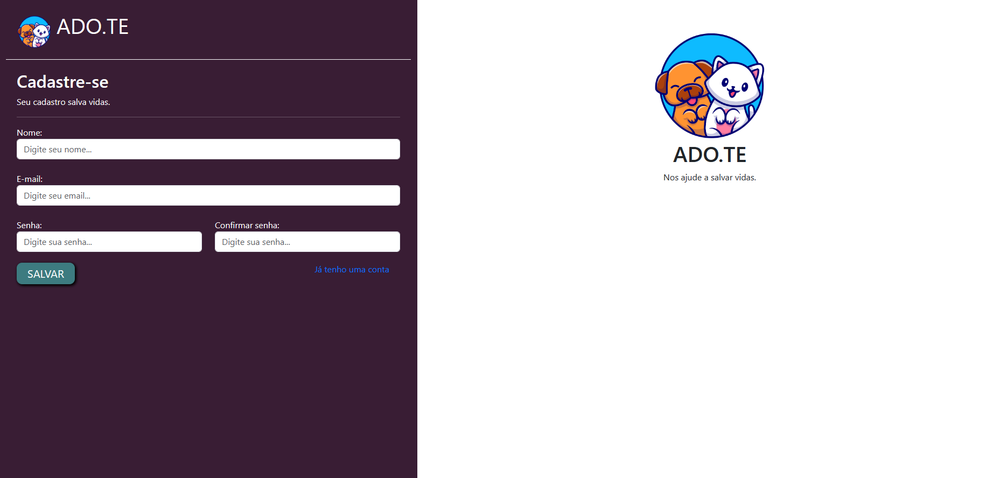
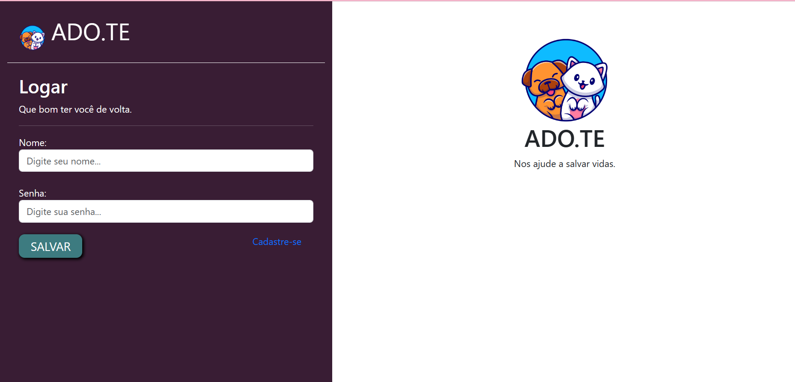
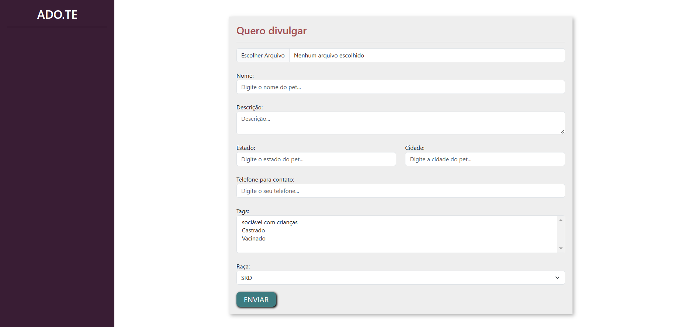
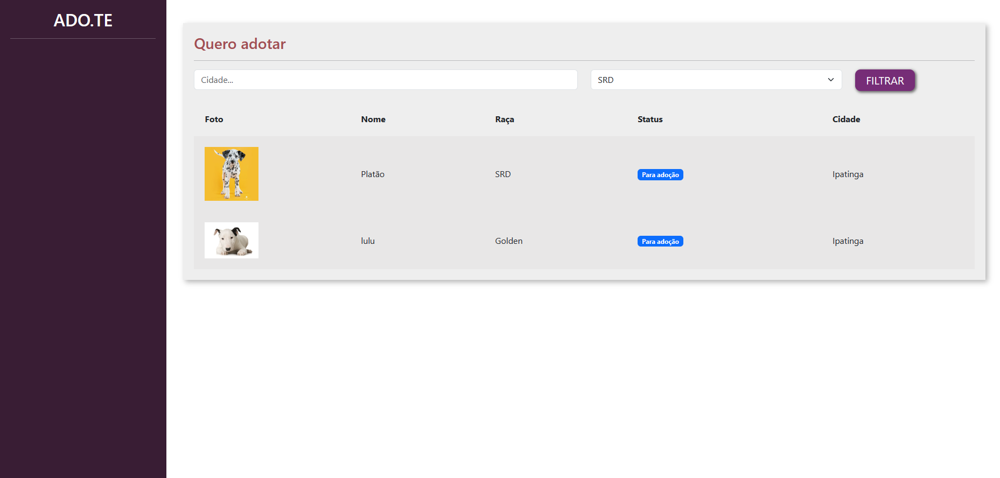
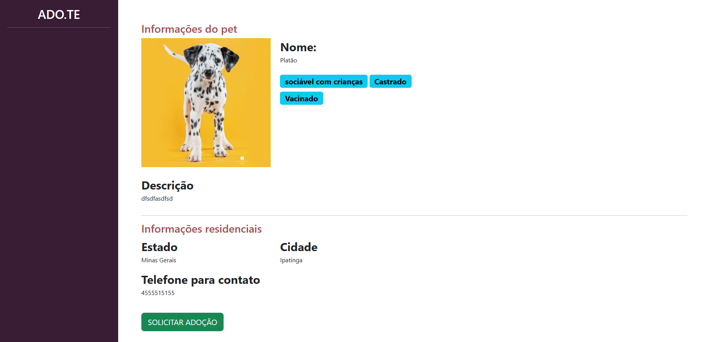
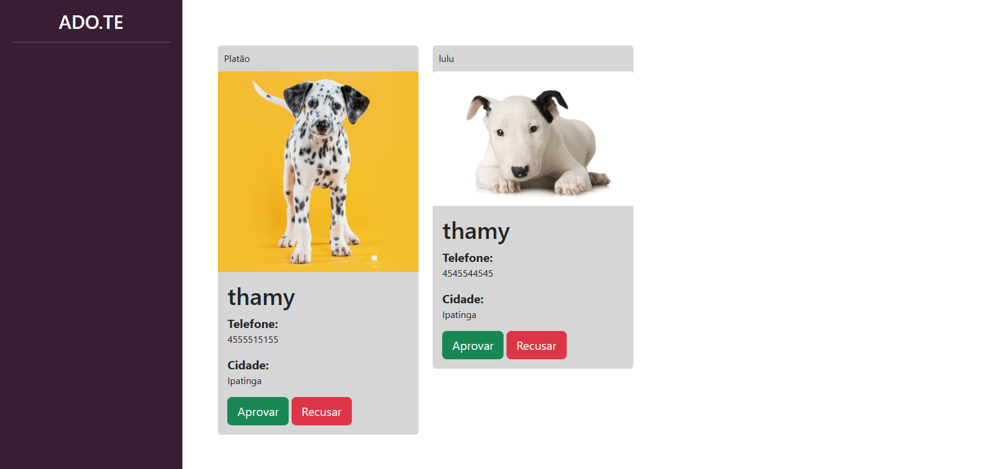
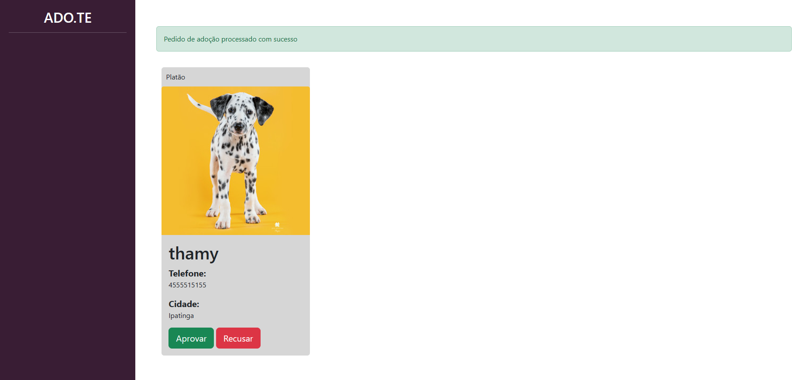
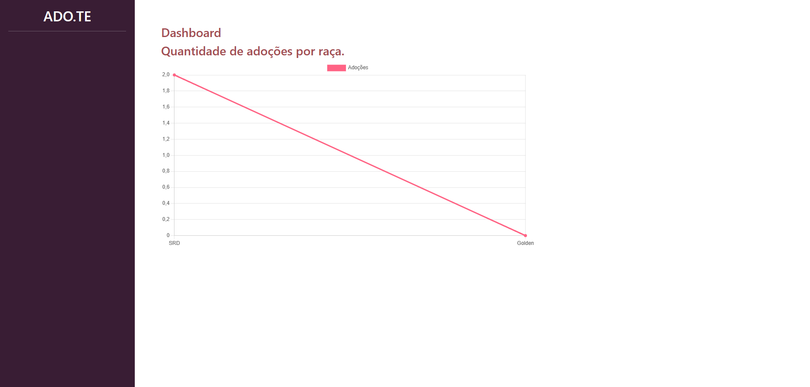

<h1 align="center"> SITE ADO.TE </h1>

 

---

Projeto desenvolvido em Pyhton junto com o Caio na PYSTACK WEEK.

 

  <a href="#-tecnologias">Tecnologias</a>&nbsp;&nbsp;&nbsp;|&nbsp;&nbsp;&nbsp;  
  <a href="#-projeto">Projeto</a>&nbsp;&nbsp;&nbsp;|&nbsp;&nbsp;&nbsp;  
  <a href="#-layouts">Layouts</a>&nbsp;&nbsp;&nbsp;&nbsp;&nbsp;&nbsp;

 

  
Criação do zero de um site para cadastro e adoção de pets.
Foram criados paginas de cadastro, login e paginas para visualização dos pets cadastros por usuarios, dashboard para apresentar a quantidade de pets adotados.

 

## 🚀 Tecnologias

Esse projeto foi desenvolvido com as seguintes tecnologias:

- Python
- Django
- HTML
- CSS
- Javascript
- Git e Github

 

## 💻 Projeto

Projeto feito em Python durante da semana PYSTACK WEEK.

 

## 📸 Layouts
Layout da tela de cadastro de usuário:

Layout da tela de login:

Layout da tela para cadastrar novo pet:

Layout da tela para pesquisar por um pet, através da raça/cidade:

Layout da tela das informações do Pet:

Layout da tela após solicitar adoção:

Layout da tela de solicitação Aparovada/Recusada:

Layout da tela de Dashboard:

 

---

Feito com ♥ by Thamyres.
